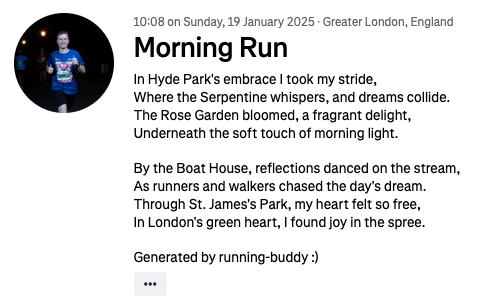

# running-buddy
An agentic AI assistant to help query and update recent Strava activities.

You can ask it to:
- fetch your recent activities on Strava, get it to answer basic questions about them
- ask it where you ran, it will then enrich the activity data using Google Maps API with street names and landmarks
- ask it to generate a poem about where you ran
- ask it to update the activity description on Strava
    - the agent will interrupt and wait for human confirmation before doing this


An updated Strava post, based on the above interaction:


## LangGraph graph


## Setup
### Using my app
I currently only have it working locally, but I'm hoping to get friends to try it out soon where I'll host it somewhere for a short period of time. At time of writing you'll need to set up the app yourself and run it.
### Setting up the app
- To run this yourself, you'll first need to create an app here: https://www.strava.com/settings/api 
    - This will provide you with `APP_CLIENT_ID` and `APP_CLIENT_SECRET`, which go into `.env` file
- You'll also need an OpenAI API key, Google Maps API key, which go into `.env`
- Install Poetry and use it to install dependencies via `poetry install`
- In a terminal, run
```
poetry run uvicorn src.app.main:app --reload
```
- Open up http://localhost:8000/
- This will first ask you to authenticate with Strava
    - click the button and allow access to the app
    - what this is doing is telling Strava the app is allowed to read your activities and write updates to them, otherwise you won't have full `running-buddy` functionality
- After authenticating it will take you to the chat-ui page and you'll be able to chat away

